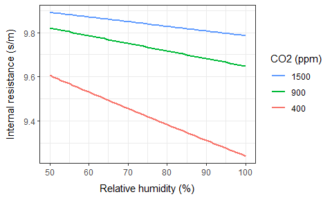

# Greenhouse virtualization

# Layer characterization

## Sky layer

The radiation emitted downwards from the sky includes $$E_{sky}^{par}$$, $$E_{sky}^{sw}$$ and $$E_{sky}^{lw}$$. PAR and short wave radiation originates from the sun, while long wave radiation is emitted from the sky as such.

While $$E_{sky}^{sw}$$ is measured routinely, this is not the case for $$E_{sky}^{par}$$. It can be approximated by  $$E_{sky}^{par}=0.5E_{sky}^{sw}$$. 

Sky emissivity $$\epsilon_{sky}$$ (and thereby sky absorptivity $$\alpha_{sky}$$) is estimated from the dew point temperature $$T_{dew}$$ (&deg;C) by the empirical relation (ref.)
$$
\epsilon_{sky} = \left\lceil 0.732 + 0.00635T_{dew}\right\rceil^1
$$
Sky temperature $$T_{sky}$$ (&deg;C) is then derived from outdoors temperature $$T_{out}$$ (&deg;C) according to [Karn et al. 2019](https://onlinelibrary.wiley.com/doi/full/10.1002/htj.21459) 
$$
T_{sky} = \sqrt[4]{\epsilon_{sky}}(T_{out} + T_0) - T_0
$$
where $$T_0=273.15$$ &deg;C.

Sky reflectivity $$\rho_{sky}$$ is zero and consequently transmissivity is $$\tau_{sky}=1-\epsilon_{sky}$$.

## Cover layer

The cover layer is commonly made out of glass with the following typical characteristics:

| Glass properties                       | PAR  | Short-wave | Long-wave |
| -------------------------------------- | ---- | ---------- | --------- |
| $$\alpha, \alpha', \epsilon, \epsilon'$$ | 0.1  | 0.1        | 0.9       |
| $$\rho, \rho'$$                          | 0.1  | 0.1        | 0.1       |
| $$\tau, \tau'$$                          | 0.8  | 0.8        | 0.0       |

In general, the six faces of the greenhouse may carry different covers with different radiative properties. For the cover layer as a whole, each radiative parameter is summarised as the average over all faces, weighed by face area.

The density of window glass is typically $$2.5$$ kg/m^2^/mm, which with a thickness of $$4$$ mm gives a density of $$10$$ kg/m^2^ cover. The heat capacity of glass is $$840$$ J/kg/K ([Engineering Toolbox, 2023](https://www.engineeringtoolbox.com/specific-heat-capacity-d_391.html)). If we furthermore assume a cover/ground ratio of $$1.24$$ m^2^ cover/m^2^ ground (eq. $$\ref{eq_cai}$$), we get a heat capacity of the cover of
$$
\begin{equation}
C_{cover}= 10 \text{ kg/m}^2\text{ cover} \cdot
1.241\text{ m}^2\text{ cover/m}^2\text{ ground} \cdot
840 \text{ J/kg/K}=
10\,421 \text{ J/K/m}^2\text{ ground}
\label{eq_c_glass}
\end{equation}
$$
The cover emits long-wave radiation symmetrically down and up according to the Stefan-Boltzmann Law (eq. $$\ref{stefan_boltzmann}$$).

The $$U$$-values over both the inner and outer surface can be expected to increase with the wind; immobile air is a very good insulator. For the outer surface of the cover, we use the empirical relation,
$$
\begin{equation}
U_{wind} = 2.8+1.2\cdot w^{0.8}
\label{eq_u_wind}
\end{equation}
$$
where $$w$$ is the outdoors wind speed (m/s). The $$U$$-value of the inner surface is set to $$1.2$$ W/K/m^2^.

### Cover averaging

Since the six cover faces may differ in their characteristics, we may need to average their parameter values. Some examples applying the equations below of are shown in the `cover-averaging.R` script.

#### Cover averaging of radiative parameters

Let's assume that the two end faces differ from the other four faces; we set $$\alpha=0.15$$, $$\rho=0.35$$ and $$\tau=0.60$$ at the ends walls, while elsewhere, $$\alpha=0.10$$, $$\rho=0.10$$ and $$\tau=0.80$$. In the full model, these values have been corrected for the effects of [chalking](#chalk-actuator) before the averaging. Furthermore, let's weigh the end walls by $$w_{end}=0.25$$ and one side by $$w_{side1}=0.20$$ while the rest have full weight $$w_{other}=1.0$$. 

For the radiative parameters ($$\alpha$$, $$\rho$$ and $$\tau$$), we get their weighted averages ($$\alpha_{cover}$$, $$\rho_{cover}$$ and $$\tau_{cover}$$) for the cover as whole by 
$$
\begin{equation}
\begin{split}
\alpha^0=\frac{\sum_{i=1}^6w_iA_i\alpha_i}{\sum_{i=1}^6w_iA_i},\quad
\rho^0&=\frac{\sum_{i=1}^6w_iA_i\rho_i}{\sum_{i=1}^6w_iA_i},\quad
\tau^0=\frac{\sum_{i=1}^6w_iA_i\tau_i}{\sum_{i=1}^6w_iA_i} \\[6pt]
\alpha_{cover}=\frac{\alpha^0}{\alpha^0+\rho^0+\tau^0},\quad
\rho_{cover}&=\frac{\rho^0}{\alpha^0+\rho^0+\tau^0},\quad
\tau_{cover}=\frac{\tau^0}{\alpha^0+\rho^0+\tau^0}
\end{split}
\label{eq_q_cover}
\end{equation}
$$
where subscript $$i$$ stands for the six cover faces, and $$A_i$$ (m^2^) is the area of each face. Since $$\alpha^0+\rho^0+\tau^0=1$$ is not guaranteed, these values are subsequently rescaled to a sum of $$1$$.

With the numbers above and the illustrative [greenhouse dimensions](#greenhouse-dimensions) we have (with parameters pair-wise in the order: roofs, sides, ends)
$$
\begin{split}
\bar{w} &= (1,1,1,0.20,0.10,0.10) \\[6pt]
\bar{A} &= (5\,459,5\,459,350,350,394,394) \text{ m}^2\text{ cover} \\[6pt]
\bar{\alpha} &= ( 0.10,  0.10,  0.10,  0.10,  0.15,  0.15) \\[6pt]
\bar{\rho} &= ( 0.10,  0.10,  0.10,  0.10,  0.35,  0.35) \\[6pt]
\bar{\tau} &= ( 0.80,  0.80,  0.80,  0.80,  0.60,  0.60 ) 
\end{split}
$$
which gives us the averaged values,
$$
\begin{split}
\alpha_{cover} &= 0.101 \\[6pt]
\rho_{cover} &= 0.104 \\[6pt]
\tau_{cover} &= 0.795 
\end{split}
$$
The roof faces are dominating by their size; hence the average parameter values are close to the roof values. If we change all weights to one $$w_i=1$$, we get a larger impact of the ends: $$\alpha_{cover}=0.102$$, $$\rho_{cover}=0.115$$ and $$\alpha_{cover}=0.783$$.

#### Cover averaging of heat capacity

Heat capacity is averaged to apply to the greenhouse ground area (eq. $$\ref{eq_c_glass}$$). If, for example, the largest area is covered by glass with a heat capacity of $$C_{glass}=8\,400$$ J/K/m^2^ cover, while the ends have a more sturdy material with  $$C_{sturdy}=18\,000$$ J/K/m^2^ cover, we can calculate the total heat capacity of the cover per greenhouse area $$C_{cover}$$ (J/K/m^2^ ground) as
$$
\begin{equation}
C_{cover} = \frac{\sum_{i=1}^6 A_iC_i}{A_{gh}}
\label{eq_c_cover}
\end{equation}
$$
where $$A_{gh}$$ (m^2^) is the ground area of the greenhouse. We apply no weights to the different greenhouse faces, other than their areas, when averaging the heat capacity.

Using the the illustrative [greenhouse dimensions](#greenhouse-dimensions) we have
$$
\begin{split}
\bar{A} &= (5\,459,5\,459,350,350,394,394) \text{ m}^2\text{ cover} \\[6pt]
\bar{C} &= (8\,400,8\,400,8\,400,8\,400,18\,000,18\,000) \text{ J/K/m}^2\text{ cover}\\[6pt]
A_{gh} &= 10\,000 \text{ m}^2\text{ ground}
\end{split}
$$
which gives us
$$
C_{cover} = 11\,177\text{ J/K/m}^2\text{ ground}
$$
As expected, this heat capacity is larger than the one calculated for and all-glass greenhouse $$C_{cover}=10\,421$$ J/K/m^2^ ground in eq. $$\ref{eq_c_glass}$$.

#### Cover averaging of U-values

The $$U_i$$ values (W/K/m^2^ cover) are conductances (one for each face, $$i=1..6$$). They can also be looked upon as resistances by taking their inverse, $$R_i=1/U_i$$. If we assume that the six resistances work like electrical resistors in parallel, we get the total resistance of the greenhouse cover $$R_{cover}$$ as
$$
\frac{1}{R_{cover}} = \sum_{i=1}^6\frac{1}{R_i}
$$
It follows that conductances are simply additive. Thus the conductance of the greenhouse cover as a whole is arrived at by the sum of the faces. Relating this to the ground area of the greenhouse $$A_{gh}$$ (m^2^ ground), we get
$$
\begin{equation}
U_{cover} = \frac{1}{A_{gh}}\sum_{i=1}^6A_iU_i
\label{eq_u_cover}
\end{equation}
$$
As for heat capacity (eq. $$\ref{eq_c_cover}$$), we apply no weights to the different greenhouse faces, other than their areas.

For example, If the cover material has $$U_{glass}=1.2$$ W/K/m^2^, except for the end walls which have $$U_{poly}=0.3$$ W/K/m^2^, we get with the illustrative [greenhouse dimensions](#greenhouse-dimensions), 
$$
\begin{split}
\bar{A} &= (5\,459,5\,459,350,350,394,394) \text{ m}^2\text{ cover} \\[6pt]
\bar{U} &= (1.2,1.2,1.2,1.2, 0.3, 0.3) \text{ W/K/m}^2\text{ cover}\\[6pt]
A_{gh} &= 10\,000 \text{ m}^2\text{ ground}
\end{split}
$$
from which follows
$$
U_{cover} = 1.42 \text{ W/K/m}^2\text{ ground}
$$

The reason why the average $$U_{cover}$$ is larger than any $$U_i$$ is that the ground area is smaller than the cover area. 

## Screen layer

Screens are often constructed with asymmetric radiative properties. Here, for example, are the radiative parameters of a polyester screen with an aluminium surface on the upper side (from [Bailey 1981](https://www.sciencedirect.com/science/article/pii/0021863481901062)): 

| Screen properties                | Long-wave radiation |
| -------------------------------- | ------------------- |
| $$\alpha', \epsilon'$$ (polyester) | 0.57                |
| $$\rho'$$ (polyester)              | 0.43                |
| $$\alpha, \epsilon$$ (aluminium)   | 0.07                |
| $$\rho$$ (aluminium)               | 0.93                |
| $$\tau', \tau$$                    | 0.0                 |

The values in the table are for long-wave radiation only. They are most likely different for short-wave radiation but documentation for the physical characteristics of screens are hard to come by; manufacturers seem reluctant to provide the information.

Screens may be more or less drawn . If we denote how much a curtain is drawn by its position $$p\in[0;1]$$ then the effective radiation parameters are calculates as $$p\alpha$$,  $$p\rho$$ and $$1-p\alpha-p\rho$$, and likewise for $$\alpha'$$, $$\rho'$$ and $$\tau'$$. For the screen layer of the greenhouse as a whole, each radiative parameter is summarised as the average over all the six faces, weighed by face area, as for the cover layer. If screens are kept half-drawn for extended periods, or if faces differ much in screen material, this averaging could turn out highly unrealistic. If the greenhouse is equipped with more than one layer of screens, the screens are stacked as separate, independent layers.

Screens may be constructed of composite materials which complicates the calculation of their heat capacity. For the screen exemplified here, we found quite close values of $$C_{polyester}=1.1$$ J/K/g and $$C_{Al}=0.89$$ J/K/g. Assuming that polyester is the dominant material and a screen density of $$80$$ g/m^2^ screen, we get a heat capacity of the screen of
$$
\begin{equation}
C_{screen}= 80 \text{ g/m}^2\text{ screen} \cdot
1.24\text{ m}^2\text{ screen/m}^2\text{ ground} \cdot
1.1 \text{ J/K/g}=
109 \text{ J/m}^2\text{ ground}
\label{eq_c_screen}
\end{equation}
$$
This calculation implies that all six greenhouses faces are equally covered  with the same screen. If that is not the case then $$S_{screen}$$ must be found by calculating the heat capacity of each face separately and adding them up to give $$S_{screen}$$. Note that the calculated heat capacity of the screen is ~100 times less that of a glass cover (eq. $$\ref{eq_c_glass}$$).

The screen emits long-wave radiation according to the Stefan-Boltzmann Law (eq. $$\ref{stefan_boltzmann}$$). With the example above, the radiation would be asymmetric because downwards and upwards emissivity differ; this screen was designed to keep the heat indoors.

### Screen averaging

The averaging of screens in a layer follows the same principles as [cover averaging](#cover-averaging), except that screens also have a position $$p\in[0;1]$$. In a given layer, there may be screens on some layers but not on others; these are given full transparency, $$\tau=\tau'=1$$.

Thus for the radiative parameter $$q$$ (i.e. $$\alpha$$, $$\rho$$,  $$\alpha'$$ or $$\rho'$$), we get the weighted average $$q_{screen}$$ for the screen layer as a whole (cf. eq. $$\ref{eq_q_cover}$$),
$$
q_{screen}=\frac{\sum_{i=1}^6p_iw_iA_iq_i}{\sum_{i=1}^6p_iw_iA_i}
$$
with transmissivity as in eq. $$\ref{eq_tau_cover}$$,
$$
\begin{split}
\tau_{screen} &= 1 - \alpha_{screen} - \rho_{screen} \\[6pt]
\tau_{screen}' &= 1 - \alpha_{screen}' - \rho_{screen}'
\end{split}
$$
The heat capacity and U-value of screens is assumed to be in effect only when they are drawn. Hence we get (cf. eqs. $$\ref{eq_c_cover}$$ and $$\ref{eq_u_cover}$$) the total heat capacity of the screen layer $$C_{screen}$$ (J/K/m^2^ ground),
$$
C_{screen} = \frac{\sum_{i=1}^6 p_iA_iC_i}{A_{gh}}
$$
and  the total U-value of the screen layer $$U_{screen}$$ (W/K/m^2^ ground),
$$
U_{screen} = \frac{1}{A_{gh}}\sum_{i=1}^6p_iA_iU_i
$$
Some examples are shown in the `screen-averaging.R` script.

### Screen layering

Screen layers function just like any other layer (see [Layers](#layers)).  Thus there is need for special mechanisms to account for screen layering.

## Growth light layer 

Lamps are installed to provide growth light. Even so, their production of heat is a significant side effect. Light is traditionally emitted downwards from a position above the canopy. If the installed lamp power (including any ballast or driver needed by the lamps) is $$P_{lamp}$$ (W/m^2^) and the PAR efficiency is $$e_{lamp}$$ (&mu;mol PAR/J) then the emission of PAR downwards $$E_{lamp}^{par}$$  and upwards $${E_{lamp}^{par}}'$$ (&mu;mol PAR/m^2^) is
$$
\begin{split}
E_{lamp}^{par} &= e_{lamp}P_{lamp} \\\
{E_{lamp}^{par}}' &= 0
\end{split}
$$
Lamps may loose efficiency with age, which is reflected in a reduced $$e_{lamp}$$.

Energy is dissipated from the lamps  by three routes: short-waved and long-waved radiation and convection. The proportions are denoted $$p_{lamp}^{sw}$$, $$p_{lamp}^{lw}$$ and $$p_{lamp}^{conv}$$, where $$p_{lamp}^{sw}+p_{lamp}^{lw}+p_{lamp}^{conv}=1$$. While the short-wave radiation is assumed to be heading only downwards, the long-wave radiation and convective heat are both assumed to be emitted equally downward and upwards. Thus we have
$$
\begin{split}
E_{lamp}^{sw} &= p_{lamp}^{sw}P_{lamp} \\\
{E_{lamp}^{sw}}' &= 0\\[6pt]
E_{lamp}^{lw} &= \\\
{E_{lamp}^{lw}}' &= p_{lamp}^{lw}P_{lamp}/2 \\[6pt]
E_{lamp}^{conv} &= \\\
{E_{lamp}^{conv}}' &= p_{lamp}^{conv}P_{lamp}/2 \\[6pt]
\end{split}
$$
The growth light layer has a 100% transmissivity ($$\tau=\tau'=1$$) and is attributed neither a temperature nor a heat capacity.

## Plant canopy layer

[Stanghellini (1987 ,eq. 2.1)](https://research.wur.nl/en/publications/transpiration-of-greenhouse-crops-an-aid-to-climate-management) sets up the following energy balance for the plant canopy
$$
R_n=H+LE+M+J\quad\left[\text{W/m}^2\right]
$$
The equation states (in her notation) that the energy of net radiation absorbed by the canopy $$R_n$$ is spent on 

* convective heat loss to the greenhouse air $$H$$ 
* heat for the evaporation of water needed for transpiration $$LE$$
* photosynthate production $$M$$
* heat storage in the canopy $$J$$

Like Stanghellini we will ignore $$M$$ and $$J$$ in the energy budget (they both make quite small contributions to the total budget) and follow her logic which leads to, surprisingly, that $$H$$ does not need to be taken explicitly into account either.

### Radiative properties

[Goudriaan (1977)](https://library.wur.nl/WebQuery/wurpubs/70980) provides equations (his eqs. 2.21 and 2.26) to calculate the reflectivity of a plant canopy with leaf area index $$L_{ai}$$ and extinction coefficient $$k$$. The reflection coefficient $$\rho_h$$ depends on the scattering coefficient $$\sigma$$,
$$
\rho_h=\frac{1-\sqrt{1-\sigma}}{1+\sqrt{1-\sigma}}
$$
$$\sigma$$ is a species-dependent parameter commonly set to $$\sigma=0.2$$ ([Kropff and Laar 1993, p.38](https://research.wur.nl/en/publications/modelling-crop-weed-interactions)), which gives $$\rho_h=0.0557$$.

The original eq. 2.26 includes the reflectivity of the surface underneath the canopy (the floor in our case). However, we will resolve the distribution of radiation among the greenhouse layers otherwise. Consequently, we can set the reflectivity of the underlying surface in the original equation to zero. Thus we get the reflectivity of the canopy, which is symmetric for up- and down-going radiation, based on his eq.2.26,
$$
\begin{equation}
\rho_{plant}^{r} = {\rho_{plant}^{r}}' =
\frac{exp(-k^{r}L_{ai})-exp(k^{r}L_{ai})}{\rho_h exp(-k^{r}L_{ai})-exp(k^{r}L_{ai})/\rho_h} \\[6pt]
\label{eq_rho}
\end{equation}
$$
where superscript $$r$$ denotes $$par$$, $$sw$$ or $$lw$$ radiation. Commonly found values for $$k^{par}$$ and $$k^{sw}$$ are in the range $$0.7$$ to $$0.8$$, while leaves are impenetrable to long-wave radiation resulting in $$k^{lw}=1$$.

The absorptivity of the canopy is simply
$$
\begin{equation}
\alpha_{plant}^r = {\alpha_{plant}^r}' = 1-exp(-k^rL_{ai})
\label{eq_alpha}
\end{equation}
$$
and the transmissivity
$$
\begin{equation}
\tau_{plant}^r = {\tau_{plant}^r}' = 1- \rho_{plant}^r - \alpha_{plant}^r
= 1- {\rho_{plant}^r}'- {\alpha_{plant}^r}'
\label{eq_tau}
\end{equation}
$$
The `plant-canopy-layer.R` script shows how the parameters change with increasing leaf area index for short-wave ($$k=0.7$$) and long-wave radiation ($$k=1$$):

### Canopy temperature

Note:  The figures in this sub-section were generated by the `5-energy-budget-plant.R` script.

The model of canopy temperature is taken from [Stanghellini (1987 ,eq. 3.5)](https://research.wur.nl/en/publications/transpiration-of-greenhouse-crops-an-aid-to-climate-management):
$$
\begin{equation}
T_{plant} = T_{in} +
\frac
{\frac{r_i+r_e}{2L_{ai}\rho_a C_a}A_{plant}^{rad} - 
\frac{1}{\gamma}(H_{sat}^{pres} - H_{in}^{pres})}
{1+\frac{\delta}{\gamma} + \frac{r_i}{r_e}}
\label{eq_t_plant}
\end{equation}
$$
with 

* plant and indoors climate variables

  * $$T_{plant}$$ : Canopy temperature (&deg;C) 

  * $$T_{in}$$ : Indoors air temperature (&deg;C)

  * $$L_{ai}$$ : Leaf area index (m^2^ leaf/m^2^ ground)

  * $$r_i=r_i^{H_2O}$$ : Internal (stomatal) leaf resistance against water vapour (s/m)

  * $$r_e=r_e^{H_2O}$$ : External (boundary layer) leaf resistance against water vapour (s/m)

  * $$A_{plant}^{rad}$$: Net radiation absorbed by the canopy (W/m^2^)

  * $$H_{in}^{pres}$$ : Indoors air vapour pressure (Pa)

  * $$H_{sat}^{pres}$$ : Saturated air vapour pressure (Pa), a function of $$T_{in}$$

* physical variables
  * $$\delta$$ : Slope of saturated vapour pressure curve (Pa/K)

* physical constants and approximations
  * $$\lambda$$: Latent heat of vapourisation of water ($$2\,454$$ kJ/kg )
  * $$\gamma$$: The psychrometric constant, which tells how the partial pressure of water vapour changes with changes in air temperature ($$67.71$$ Pa/K at standard air pressure)
  * $$\rho_a$$: Air density, which depends on air pressure, air humidity and temperature [(Shelquist, 2023)](https://wahiduddin.net/calc/density_altitude.htm); here assumed constant ($$1.19$$ kg/m^3^) 
  * $$C_a$$: Air heat capacity, which depends on air humidity and temperature [(Powder Process, 2023)](https://powderprocess.net/Tools_html/Air/Air_Humid_Specific_Heat.html); here assumed constant ($$1\,020$$ J/kg/K)

The saturated vapour pressure $$H_{sat}(T)$$ as a function of temperature is described by the empirical equation [(FAO, 2023, eq. 11)](https://www.fao.org/3/x0490e/x0490e07.htm),
$$
\begin{equation}
H_{sat}(T) = 610.8\cdot\exp\left(\frac{17.27\cdot T}{T+237.3}\right)
\label{eq_svp}
\end{equation}
$$
It increases with temperature, as seen in the figure:

The slope $$\delta(T)$$ as a function of temperature is described by the empirical equation [(FAO, 2023, eq. 13)](https://www.fao.org/3/x0490e/x0490e07.htm),
$$
\begin{equation}
\delta(T) = \frac{4098}{(T+237.3)^2}\cdot H_{sat}(T)
\label{eq_svp_slope}
\end{equation}
$$
The slope is increasing with temperature too, as seen in the figure:

The internal leaf (stomatal) resistance against water vapour $$r_i^{H_2O}$$ is computed by the Ball-Barry (ref.) function,
$$
\begin{equation}
r_i^{H_2O} = \left[ g_0 + g_1\frac{H_{in}^{rel}}{100\%}\frac{P_n}{c_{in}^{CO_2}} \right]^{-1}
\label{eq_ri}
\end{equation}
$$
with species-specific coefficients that we here set to $$g_0=0.1$$ m/s and $$g_1=1.64$$ m^3^/mol. Other variables are

* $$H_{in}^{rel}$$: Relative humidity of the indoors air (%)
* $$c_{in}^{CO_2}$$: Indoors CO~2~ concentration (ppm)
* $$P_n:$$ Net photosynthetic rate (μmol CO~2~ / leaf m^2^ / s)

Here is an example, how $$r_i^{H_2O}$$ behaves with increasing humidity at various CO~2~ levels and with $$P_n=2.0$$ μmol CO~2~ / m^2^ leaf / s. There is not much variation from the maximum set by $$g_0^{-1}$$:

The external leaf (boundary layer) resistance to water vapour $$r_e^{H_2O}$$ can be computed according to  [Stanghellini (1987, eq. 2.53)](https://research.wur.nl/en/publications/transpiration-of-greenhouse-crops-an-aid-to-climate-management):
$$
\begin{equation}
r_e^{H_2O} = \frac{1\,174\sqrt{\ell}}{\sqrt[4]{\ell |T_{plant}-T_{in}| + 207u^2 }}
\label{eq_re_stangh}
\end{equation}
$$
where $$\ell$$ characterizes leaf dimensions and $$u$$ (m/s) is air velocity at the leaf surface. The constants $$1\,174$$ and $$207$$ were estimated empirically in a tomato crop by Stanghellini.

This figure shows the behaviour of $$r_e^{H_2O}$$ with increasing wind speed, at different leaf temperatures and leaf dimensions with $$T_{in}=24$$&deg;C:

Both $$\ell$$ and $$u$$ are difficult to estimate. $$\ell$$ should be smaller for smaller leaves. $$u$$ should increase with the greenhouse ventilation rate (or if rotors are running) and decrease with $$L_{ai}$$, as a denser canopy will reduce the average wind speed at leaf surfaces. 

**Note:** Due to all the uncertainties, we use a fixed value in the model defaulting to 
$$
\begin{equation}
r_e^{H_2O}=200 \text{ s/m}
\label{eq_re}
\end{equation}
$$
Everything above taken together, we get the following linear response of plant temperature $$T_{plant}$$ (eq. $$\ref{eq_t_plant}$$) to the radiation absorbed by canopy $$A_{plant}^{rad}$$ with $$L_{ai}=1.9$$. The indoors temperature was set at $$T_{in}=25$$&deg;C and is shown as a black line in the figure: 

Clearly, a high air humidity works against  plant transpiration and leads to a higher leaf temperature, even above the ambient temperature of the greenhouse: Relatively cool leaves are a sign of a sound microclimate.

### Transpiration

Note:  The figures in this sub-section were generated by the `5-energy-budget-plant.R` script.

The model of canopy transpiration rate $$H_{plant}^{trans}$$ (kg/m^2^ ground/s) is taken from [Stanghellini (1987 ,eq. 3.4)](https://research.wur.nl/en/publications/transpiration-of-greenhouse-crops-an-aid-to-climate-management):
$$
\begin{equation}
H_{plant}^{trans} = 
\frac
{\frac{\delta}{\gamma}A_{plant}^{rad} + 
\frac{2L_{ai}\rho_a C_a}{\gamma\,r_e}(H_{sat}^{pres} - H_{in}^{pres})}
{\lambda\left(1+\frac{\delta}{\gamma} + \frac{r_i}{r_e}\right)}
\label{eq_transpiration}
\end{equation}
$$
with symbols defined as for eq. $$\ref{eq_t_plant}$$. With the same parameter settings as for the previous figure, we get this transpiration rate of the canopy (shown in units of g/m^2^ ground/min):

Obviously, transpiration is larger in a drier climate and it increases with the absorbed radiation. Note that leaf temperature (previous figure) too increased with absorbed radiation. This means that the increase in transpiration with increased absorbed radiation was not sufficient to keep leaf temperature constant; that would have acquired an even higher transpiration.

The phase change from water (in the plant) to water vapour (in the greenhouse air) causes an increase in the latent heat carried by the air. This heat, which is equal to $$\lambda H_{plant}^{trans}$$, is shown in the figure below,

The 1:1 dashed line has been added to highlight the balance between the radiation absorbed by the canopy and the latent heat lost from the canopy. Below the line the canopy is warmer than the air, above the line the canopy is cooler than the air. Compare this with the figure of canopy temperature above. At a relative humidity of 90%, both the blue lines cross the respective reference lines at *ca.* $$110$$ W/m^2^. This verifies the consistency of eqs. $$\ref{eq_t_plant}$$ and $$\ref{eq_transpiration}$$. The radiative energy absorbed by the canopy ends up in latent heat bound in the air and in the heating of the canopy itself. 

The convective model of heat transfer does not match the complex physiology and physics of the canopy layer; all heat fluxes are taken care of by eqs. $$\ref{eq_t_plant}$$ and $$\ref{eq_transpiration}$$. Therefore the canopy layer is given a $$U$$-value of zero to make it fit into the stack of generic layers.

## Heat pipe layer

Heat pipes are installed to heat the greenhouse by convection and long-wave radiation. The transmissivity of the heat pipe layer is $$\tau_{pipe}=\tau_{pipe}'=1$$ for all wave lengths.

The drop in temperature ($$\Delta T_{pipe}$$; K) from the inlet to the outlet is modelled by the empirical equation
$$
\begin{equation}
\Delta T_{pipe} = \left( T_{pipe}^{inlet} - T_{in}\right) -
\left[k(b-1)\Delta t_{pipe} + \left(T_{pipe}^{inlet} - T_{in} \right)^{1-b}\right]^\frac{1}{1-b}
\quad\text{when}\quad T_{pipe}^{inlet} > T_{in}
\label{eq_t_pipe}
\end{equation}
$$
where $$k$$ and $$b$$ are parameters calibrated to the greenhouse, $$\Delta t_{pipe}$$ (s) is the transit time of pipe water, $$T_{pipe}^{inlet}$$ (&deg;C) is the water temperature at the pipe inlet, and $$T_{in}$$ (&deg;C) is the greenhouse air temperature. If the inlet temperature is not above the greenhouse temperature then $$\Delta T_{pipe}=0$$.

The transit time $$\Delta t_{pipe}$$ (min) is related to the flow rate $$\dot{v}_{pipe}$$ (m^3^/h) and pipe volume $$V_{pipe}$$ (m^3^) as
$$
\Delta t_{pipe} = \frac{V_{pipe}}{\dot{v}_{pipe}}
$$
As an example, a pipe with an inner diameter of 30 mm installed at a density of 2 m/m^2^ in a greenhouse area of 10 000 m^2^ holds the volume,
$$
\begin{equation}
V_{pipe} = \frac{\pi}{4}\cdot\left(30\text{ mm}\cdot\frac{1\text{ m}}{1\,000\text{ mm}} \right)^2 \cdot 
2 \frac{\text{m}}{\text{m}^2}\cdot10\,000\text{ m}^2 = 14.14\text{ m}^3
\label{eq_Vpipe}
\end{equation}
$$
which at a flow rate of $$\dot{v}_{pipe}=20$$ m^3^/h gives a transit time of
$$
\Delta t_{pipe} = \frac{14.14\text{ m}^3}{20\text{ m}^3\text{/h}} \cdot
\frac{60\text{ min}}{\text{h}} = 42.4\text{ min}
$$
The energy lost from the heat pipe $$E_{pipe}^{tot}$$ (W/m^2^ ground) is related to the temperature drop through the pipe $$\Delta T_{pipe}$$ and the flow rate $$\dot{v}_{pipe}$$, 
$$
\begin{equation}
E_{pipe}^{tot}  =
\frac{C_{water}\Delta T_{pipe}\dot{v}_{pipe}}{A_{gh}} \cdot
\frac{1000\text{ kg}}{\text{m}^3} \cdot
\frac{1\text{ h}}{3\,600\text{ s}}
\label{eq_e_pipe}
\end{equation}
$$
where $$C_{water}=4\,184$$ J/K/kg is the heat capacity of water and $$A_{gh}$$ (m^2^ ground) is the ground area of the greenhouse. Proper conversion of units must be observed.  With $$\Delta T_{pipe}=30$$ K, for example, we get
$$
E_{pipe}^{tot} = \frac{4\,184\text{ J/K/kg} \cdot 30\text{ K} \cdot 20\text{ m}^3\text{/h}}
{10\,000\text{ m}^2 } \cdot
\frac{1000\text{ kg}}{\text{m}^3} \cdot
\frac{1\text{ h}}{3\,600\text{ s}} = 69.7\text{ W/m}^2
$$
As an example, we set $$k=0.0063$$ and $$b=1.25$$ with an indoors temperature $$T_{in}=20$$&deg;C. We choose a range of inlet temperatures $$T^{inlet}_{pipe}=20..80$$&deg;C and two different flow rates $$\dot{v} = (10,20)$$ m^3^/h. Other parameters keep the values used in the examples above. We then get the following drop in water temperature $$\Delta T_{pipe}$$ (eq. $$\ref{eq_t_pipe}$$) reached at the pipe outlet and the associated energy $$E_{pipe}^{tot}$$ (eq. $$\ref{eq_e_pipe}$$) lost to the greenhouse (plots generated by the `heat-pipes.R` script):

Heat pipe energy is emitted as a combination of radiant and convective heat.  We denote the proportion of long-wave radiation $$p_{pipe}^{lw}\in[0;1]$$ and, assuming that it is radiated equally down- and upwards, we get
$$
E^{lw}_{pipe} = {E^{lw}_{pipe}}' = p^{lw}_{pipe}E^{tot}_{pipe}/2
$$
The other part is conveyed to the greenhouse air. Since convective heat is defined relative to the layers (eq. $$\ref{u_heat}$$), the convective heat flow from the heat pipes is negative,
$$
A^{heat}_{pipe} = -\left(1-p^{lw}_{pipe} \right)E^{tot}_{pipe}
$$
Since the volume above and below the heat pipes is the same, i.e. the greenhouse air, we let $$A^{heat}_{pipe}$$ account for the whole heat exchange and set $${A^{heat}_{pipe}}'=0$$ (see eq. $$\ref{u_heat}$$).

## Floor layer

A floor made of concrete has typical values $$\alpha_{floor}=0.6$$ and $$\rho_{floor}=0.4$$. It emits long-wave radiation upwards according to the Stefan-Boltzmann Law (eq. $$\ref{stefan_boltzmann}$$) and exchanges heat with the soil by conduction (eq. $$\ref{u_heat}$$). We assume a good insulation of the floor against the soil setting  $$U_{floor}'=0.1$$ W/K/m^2^.

## Soil temperature

Soil is not treated as a layer in the model but as a volume below the floor layer (see [Volumes](#volumes) and [Layers](#layers)). Anyway, the model of soil temperature is naturally presented here.

Soil is defined only vaguely by the model. As a volume it is endless in reality, and it has got not a single temperature but a gradient of temperatures stretching downwards under the greenhouse and inwards from the base of the walls. Considering the complexity of vertical and horizontal gradients of soil temperature, a simple, generic model is called for. Consequently, we set soil temperature at time $$t$$ equal to the average outdoors temperature over the last 7 days.
